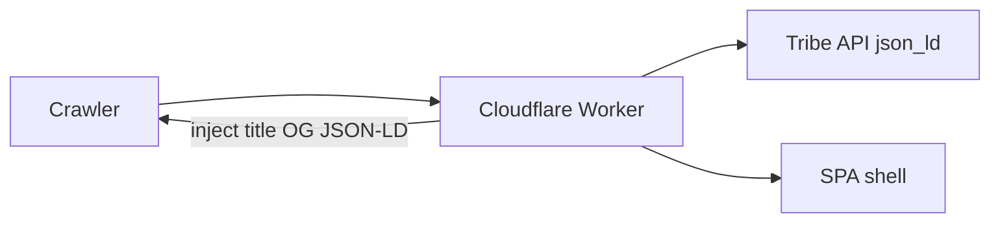

# Design: Improve PWA SEO

## Approach

Keep the static PWA and Cloudflare Worker. Inject crawlable metadata into the first HTML response for SPA routes instead of adopting full SSR.



## Key decisions

1. **Numeric event URLs** — `/event/{id}` stays canonical on mobile; no WordPress slug migration.
2. **JSON-LD pass-through** — Use Tribe single-event `json_ld`; overlay only `url`/`@id` and optional `@type` refinement.
3. **Worker injection** — Skip prerendered blog/announcement detail paths; fetch event/entity data at the edge.
4. **Index control** — Sitemap lists upcoming events only; past events get `noindex, follow`.

## Module layout

```
src/lib/seo/
  metadata.ts      # SeoMetadata, renderHeadElements
  from-event.ts    # Event title/description/json_ld
  from-entity.ts   # Organizer/venue/DJ wrappers
  from-wordpress.ts
  pages.ts         # Hub page SEO
  sitemap.ts
  worker-head.ts   # resolveSeoForPath, injectHeadIntoHtml
```
